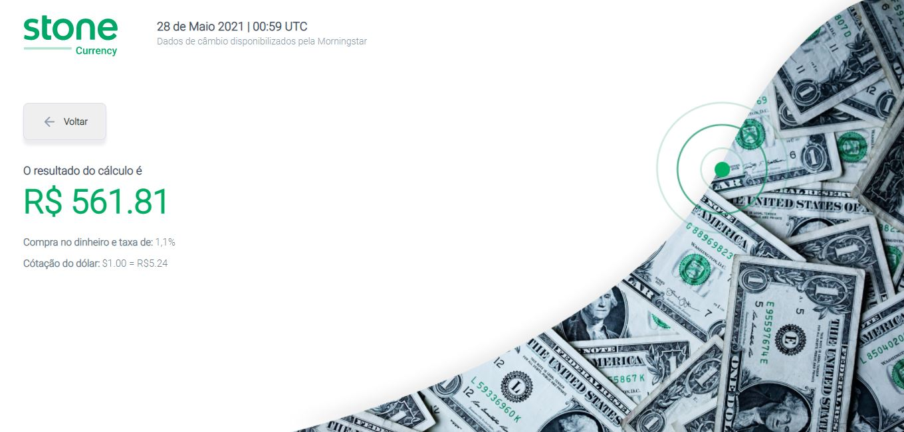

# Stone

Aplicação desenvolvida para realizar a conversão de montante em DÓLAR para REAL.

### Deploy

- Acesse a aplicação publicada [clicando aqui](https://stone-challenge-brown.vercel.app).
- Veja o protótipo do projeto [clicando aqui](https://www.figma.com/file/y8IcDbllfaFAzXrEXR05PE/Teste-Front-Web-Stone).

### Execução

```
1 - Clone a aplicação
2 - yarn install ou npm install
3 - yarn start
4 - yarn test (Caso queira realizar testes unitários)
```

### Ferramentas utilizadas

- [React](https://pt-br.reactjs.org/)
- [Styled Components](https://styled-components.com/)
- [TypeScript](https://www.typescriptlang.org/)
- [Remask](https://github.com/brunobertolini/remask)
- [React Test Library](https://testing-library.com/)
- [Jest](https://jestjs.io/pt-BR/)

### Materiais utilizados

- [Boas Práticas na Stone](https://github.com/stone-payments/stoneco-best-practices/blob/master/README_pt.md)
- [Airbnb Javascript](https://github.com/airbnb/javascript)

### Estruturação

```
app
│   
├── src
│     ├──── assets 
|     |     └── github
|     |     └── images
|     |     └── svgs 
|     |
│     ├──── components
|     |     └── converter
|     |     └── header
|     |
|     ├──── pages
|     |     └── home
|     | 
|     ├──── services
|     |     └── api
|     |
|     ├──── styles
|     |     └── globalStyles
|     |
|     ├──── utils
|           └── conversionCalculations
|           └── conversionCalculations
└── test
    └── converter.test
```

### Preview




